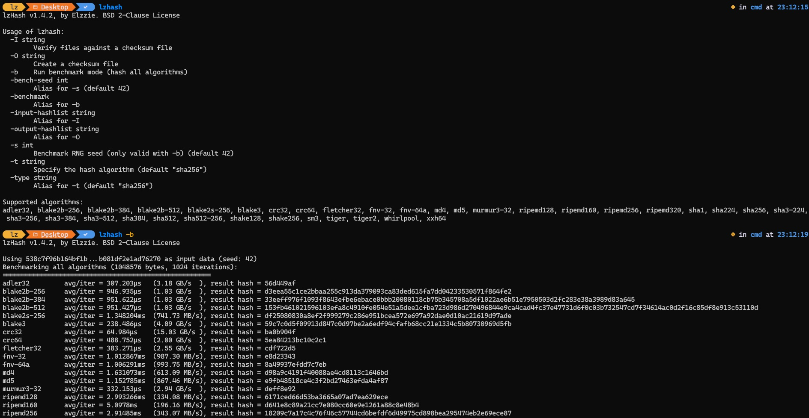

# lzhash
simple hashing utility in go


## features
* too many supported algos: adler32, blake2b-256, blake2b-384, blake2b-512, blake2s-256, blake3, crc32, crc64, fletcher32, fnv-32, fnv-64a, md4, md5, murmur3-32, ripemd128, ripemd160, ripemd256, ripemd320, sha1, sha224, sha256, sha384, sha512, sha512-256, sha3-224, sha3-256, sha3-384, sha3-512, shake128, shake256, sm3, tiger, tiger2, whirlpool, xxh64. (default is sha256)
* able to hash files, directories and strings
* pure go, so it can be compiled nearly anywhere
* integrated benchmark mode w/ seed

## how to use

```
lzhash [-t/--type algo] [-b/--benchmark] [-s/--bench-seed] <file, directory, string or hex (if starts with 0x)>
```
it's pretty easy to use, eh?

## how to compile
simply run
```
go mod init github.com/lz-fkn/lzhash
go mod tidy
go build -ldflags="-s -w" -o lzhash
```
set GOOS and GOARCH if needed.

---
lz-fkn, 2026. see LICENSE for license or something
